# 🛒 ShopEasy — Full-Stack E-Commerce Platform

ShopEasy is an enterprise-grade MERN-stack e-commerce ecosystem designed to bridge the gap between complex industrial marketplaces and small-scale independent merchants. The platform provides a dual-sided solution: a streamlined, high-conversion storefront for consumers and a robust, data-driven management suite for sellers.
## ✨ Features

### 👤 User Features

- Email & password authentication

- Google OAuth login

- Email OTP verification

- Cart management

- Account & profile management

- Dark / Light mode toggle


### 🏪 Seller Features

- Become a Seller flow

- Seller registration page

- Seller-specific navigation

- Product listing 

- Seller dashboard layout 
## 🔐 Authentication & Security

- JWT-based authentication

- Password hashing using bcrypt

- Protected routes (frontend & backend)

- Role-based access control

- Secure session handling
## 🛠️ Tech Stack

### Frontend

- React (Vite) — Fast single-page application

- Tailwind CSS — Utility-first styling with dark mode

- React Router DOM — Client-side routing

- Context API — Global state management

- Lucide React — Icon system

### Backend

- Node.js — JavaScript runtime

- Express.js — REST API framework

- MongoDB — NoSQL database

- Mongoose — ODM for schema modeling

- bcryptjs — Password encryption

- JWT — Secure authentication

- Nodemailer — Email & OTP delivery
## 🚀 Getting Started

### 1️⃣ Clone the Repository

```bash
git clone [https://github.com/manasdevX/ShopEasy.git](https://github.com/manasdevX/ShopEasy.git)
cd ShopEasy
```

### 2️⃣ Backend Setup (Terminal - 1)

```bash
cd backend
npm install
npm run start
```

### 3️⃣ Frontend Setup (Terminal- 2)

```bash
cd backend
npm install
npm run dev
```


## ⚙️ Environment Variables

```bash
# ========================
# SERVER CONFIG
# ========================
PORT=5000
FRONTEND_URL=http://localhost:5173

# ========================
# DATABASE
# ========================
MONGO_URI=mongodb+srv://<username>:<password>@cluster0.mongodb.net/<database_name>

# ========================
# AUTHENTICATION
# ========================
JWT_SECRET=your_jwt_secret_key_here
GOOGLE_CLIENT_ID=your_google_oauth_client_id_here

# ========================
# EMAIL (SMTP / BREVO)
# ========================
BREVO_API_KEY=your_brevo_api_key_here
EMAIL_USER=your_email@example.com
EMAIL_PASS=your_email_app_password_here
FROM_EMAIL=no-reply@shopeasy.com
FROM_NAME=ShopEasy

# ========================
# OTP / SMS (TWILIO)
# ========================
TWILIO_SID=your_twilio_sid_here
TWILIO_AUTH_TOKEN=your_twilio_auth_token_here
TWILIO_PHONE_NUMBER=+1234567890

# ========================
# CLOUDINARY (IMAGES)
# ========================
CLOUDINARY_CLOUD_NAME=your_cloudinary_cloud_name
CLOUDINARY_API_KEY=your_cloudinary_api_key
CLOUDINARY_API_SECRET=your_cloudinary_api_secret

# ========================
# PAYMENTS (RAZORPAY)
# ========================
RAZORPAY_KEY_ID=your_razorpay_key_id
RAZORPAY_KEY_SECRET=your_razorpay_key_secret

# ========================
# CACHE (REDIS)
# ========================
REDIS_HOST=your_redis_host
REDIS_PORT=your_redis_port
REDIS_PASSWORD=your_redis_password
```


## ⚙️ Usage

Once the application is set up and running, ShopEasy provides a complete e-commerce workflow for customers, sellers, and administrators.

### 👤 Customer Flow

#### 1. Account Access

- Users can sign up or log in using:

  - Email & password

  - Phone number with OTP

  - Google OAuth

- Authentication is secured via JWT tokens.

#### 2. Browsing & Shopping

- Browse products by categories from the navigation bar.

- View detailed product pages with pricing, ratings, availability, and images.

- Add products to the cart with quantity control.

#### 3. Cart & Checkout

- Review cart items and pricing in real time.

- Proceed to secure checkout.

- Complete payments using Razorpay with server-side verification.

#### 4. Profile Management

- Update personal details from the Account page.

- View saved addresses and manage profile preferences.

### 🛍️ Seller Flow

#### 1. Seller Registration

- Navigate to Become a Seller from the navigation bar.

- Complete seller registration with:

  - Business details

  - Contact information

  - Bank account details

#### 2. Seller Dashboard

- Access a dedicated seller panel after approval.

- Add, edit, and manage product listings.

- Upload product images via Cloudinary.

#### 3. Product & Inventory Control

- Update stock levels and pricing.

- Monitor product availability and performance.

- Manage listed products in real time.


## 📸 Screenshots

### 🛒 ShopEasy User

#### 🔐 Authentication & Onboarding
We’ve designed a secure and intuitive entry point for our merchants, featuring a multi-step registration process to ensure data integrity.

| User Login | Account Creation |
| :---: | :---: |
| 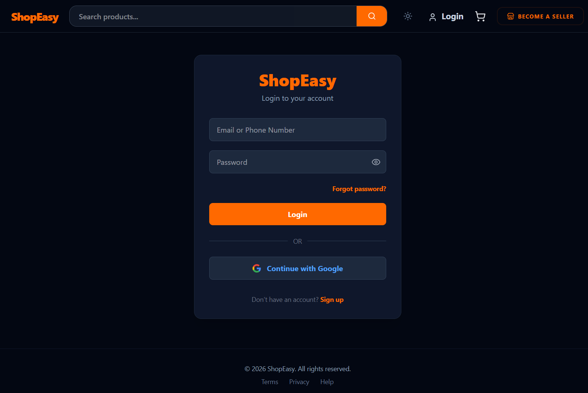 | 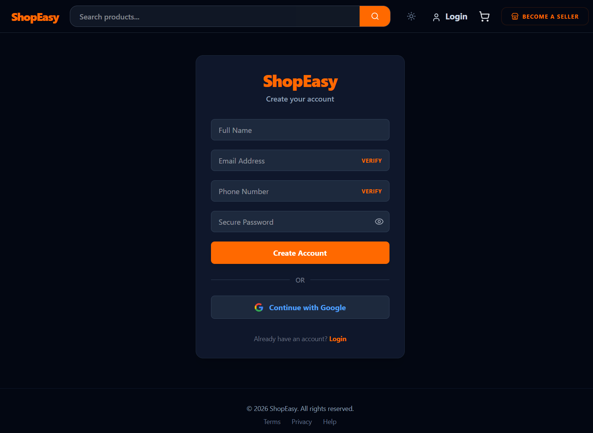 |
| **Recovery Initiation** | **OTP Verification** |
| 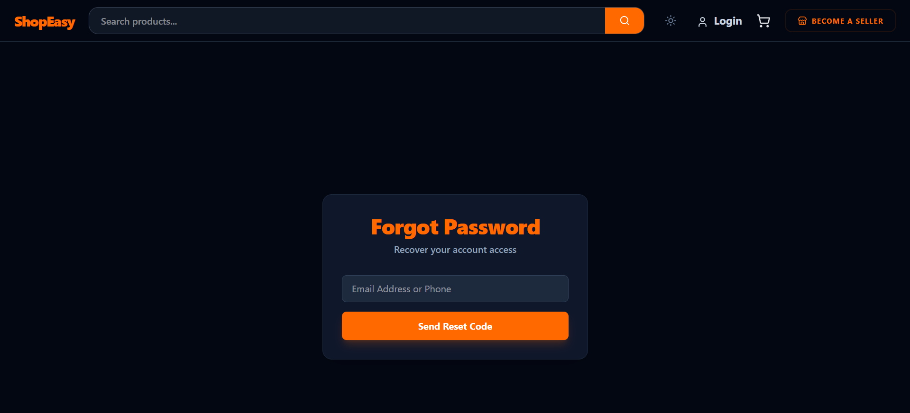 | 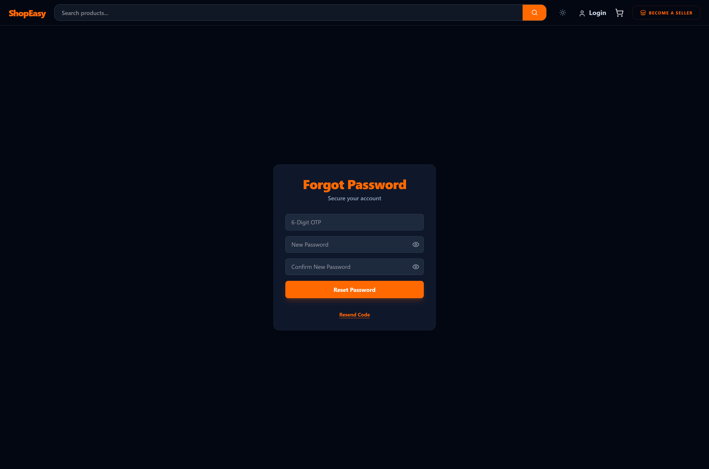 |

**Features:**
* **Instant Validation:** Real-time feedback on email formats and password strength to reduce user errors.
* **Seamless Switching:** Easy toggle between login and signup modes to minimize friction.
* **Secure Sessions:** Implementation of JWT-based authentication to keep user sessions safe across page reloads.
* **Verification:** Real time Otp based verification system for email and phone number.

#### 🛍️ Customer Experience
A seamless shopping interface designed for high performance and easy product discovery.

| Home Page + Product Search |
| :---: |
|  |
| 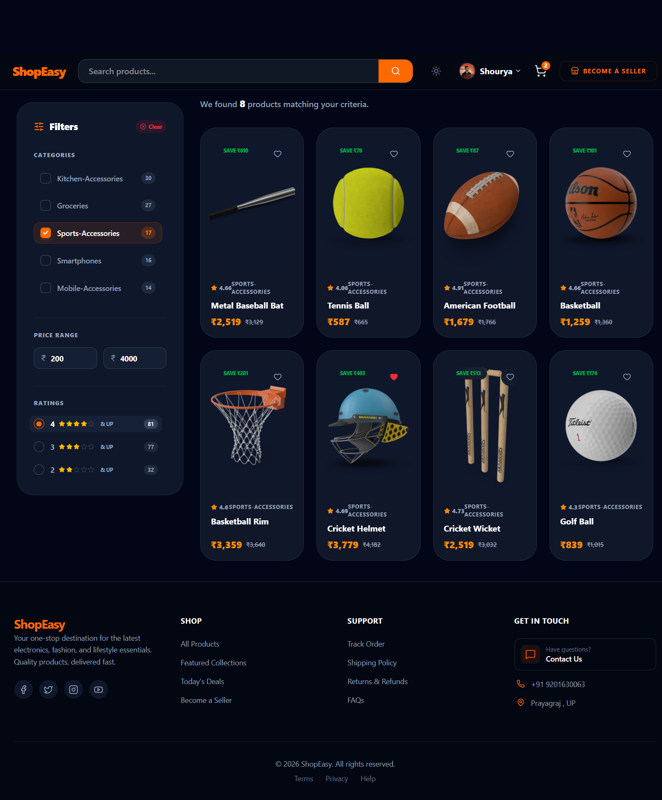 |

**Features:**
* **Responsive Layout:** Clean, modern interface optimized for desktop browsing.
* **Intuitive Search:** Fast, reliable search functionality to find products across all categories.

#### 👤 User Account & Profile
A comprehensive, all-in-one management hub where users can monitor their account status and update their personal credentials in real-time.

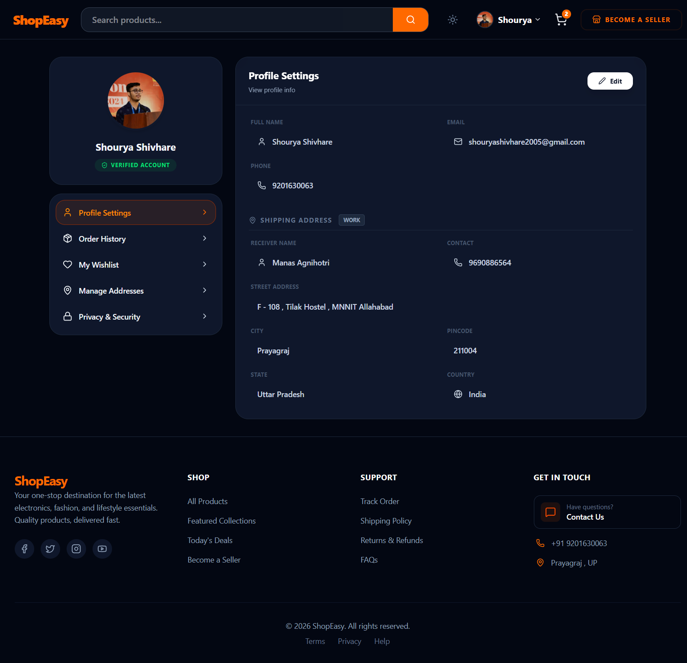

**Features:**
* **Identity Management:** View personal details with an integrated **Profile Picture Upload** feature to personalize the account.
* **Address Book Control:** Dedicated interface to add, remove, or edit **Shipping Addresses**, ensuring accurate order fulfillment.
* **Inline Editing:** Streamlined "Edit" modes that allow users to update information without leaving the page.
* **Contact Synchronization:** Real-time updates for phone numbers and email addresses, synced directly with the merchant's communication database.

#### 📦 Order History & Management
A dynamic tracking system that provides customers with full transparency and control over their purchase lifecycle.

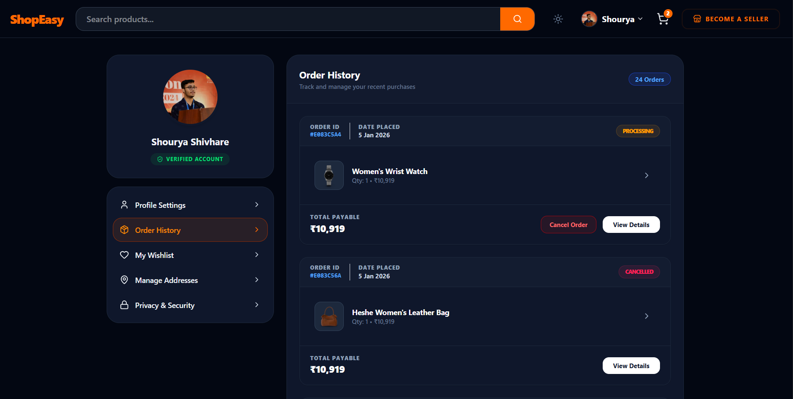

**Features:**
* **Real-Time Status Tracking:** Live updates on every order phase, including **Processing**, **Cancelled**, and **Returned** statuses.
* **Smart Order Cancellation:** Users can instantly cancel orders that are still in the **Processing** stage with a single click.
* **Integrated Return System:** Ability to initiate return requests directly from the dashboard for **Delivered** items.
* **Dynamic Action Buttons:** UI buttons update contextually based on the order status (e.g., "Cancel" only appears when valid).

#### ❤️ Personal Wishlist
A curated space for users to save their favorite products and manage their shopping interests before making a final purchase.

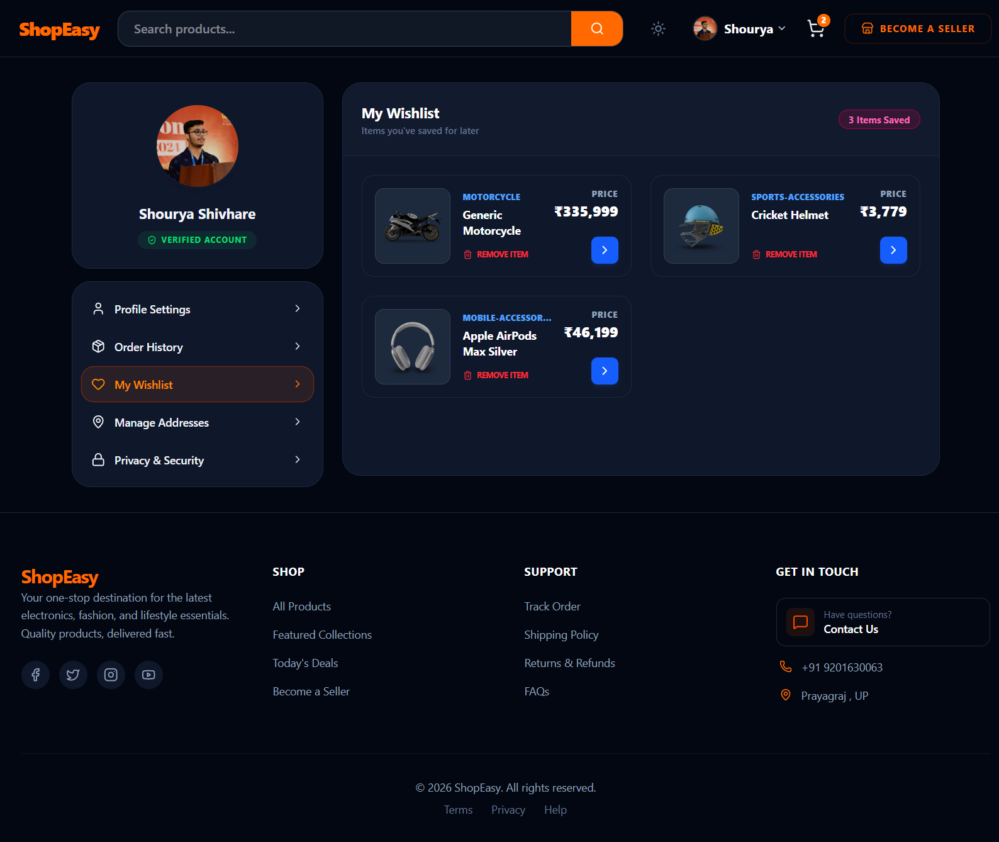

**Features:**
* **Exclusive Product Collection:** Displays only the products specifically added by the user for quick future access.
* **Instant Management:** Simple "Remove" functionality to update the wishlist and keep it organized in real-time.
* **Seamless Integration:** Direct links from the wishlist back to product details for an effortless checkout flow.
* **Clean UI:** A focused, distraction-free grid layout designed to showcase product imagery and pricing clearly.


#### 📍 Address Management
A smart address book that combines manual control with automated location intelligence for a friction-less checkout experience.

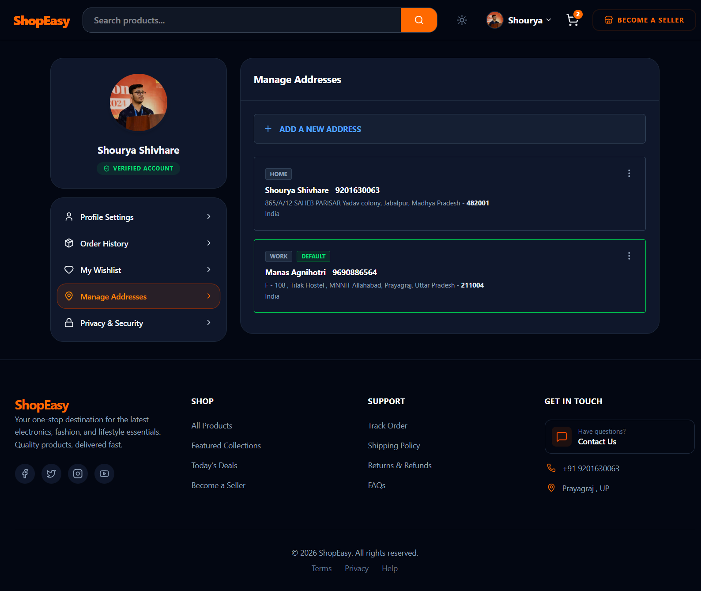

**Features:**
* **Smart Geolocation:** Features a "Use My Current Location" tool that automatically detects and fills in address details using the browser's live location API.
* **Custom Location Tagging:** Easily categorize addresses with **Home** or **Work** tags for quick selection.
* **Primary Address Selection:** Toggle a **"Set as Default"** option to prioritize a specific shipping destination.
* **Full CRUD Lifecycle:** Complete control to **Add, Update, or Delete** addresses with real-time UI synchronization.
* **Validated Data Entry:** Ensures accurate shipping by verifying address components before they are saved to the user profile.

#### 🔒 Privacy & Account Security
A robust security suite where users can manage their credentials and control their account lifecycle.

##### **Primary Privacy & Security**
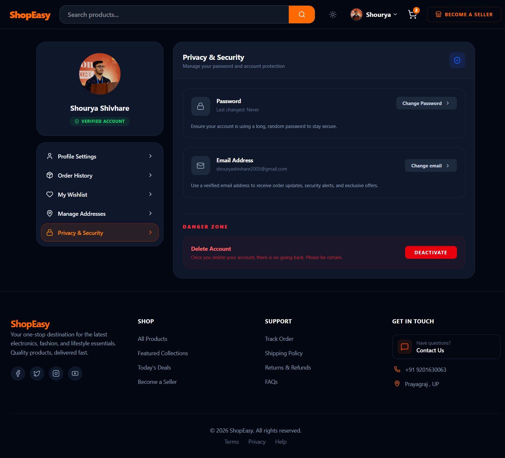

##### **Security Workflows**
We provide dedicated interfaces for sensitive account updates and recovery.

<table width="100%">
  <tr>
    <th align="center">Password Reset (Step 1)</th>
    <th align="center">Password Reset (Step 2)</th>
    <th align="center">Email Modification</th>
  </tr>
  <tr>
    <td align="center">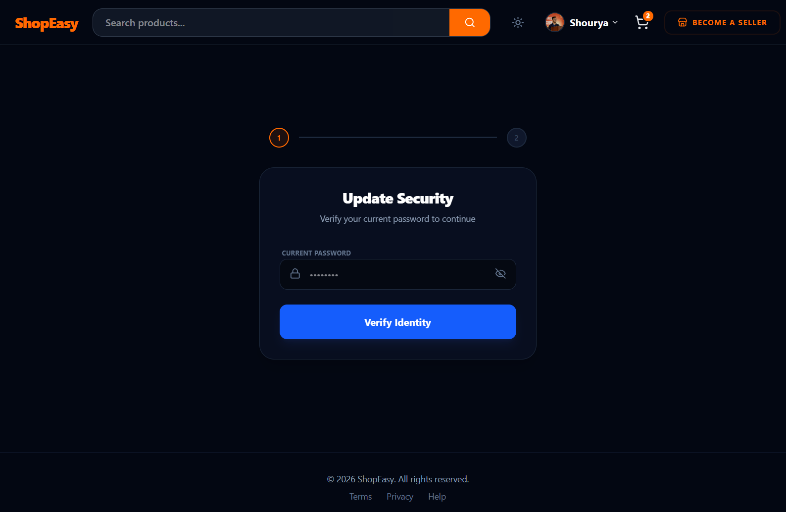</td>
    <td align="center">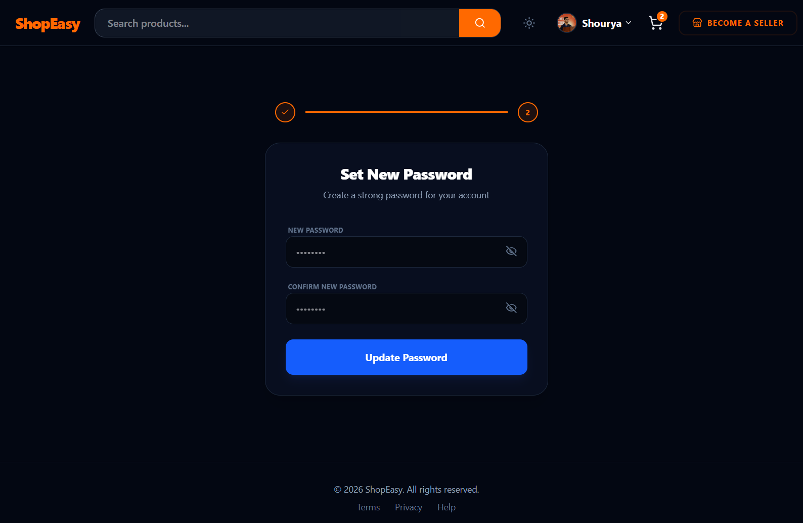</td>
    <td align="center">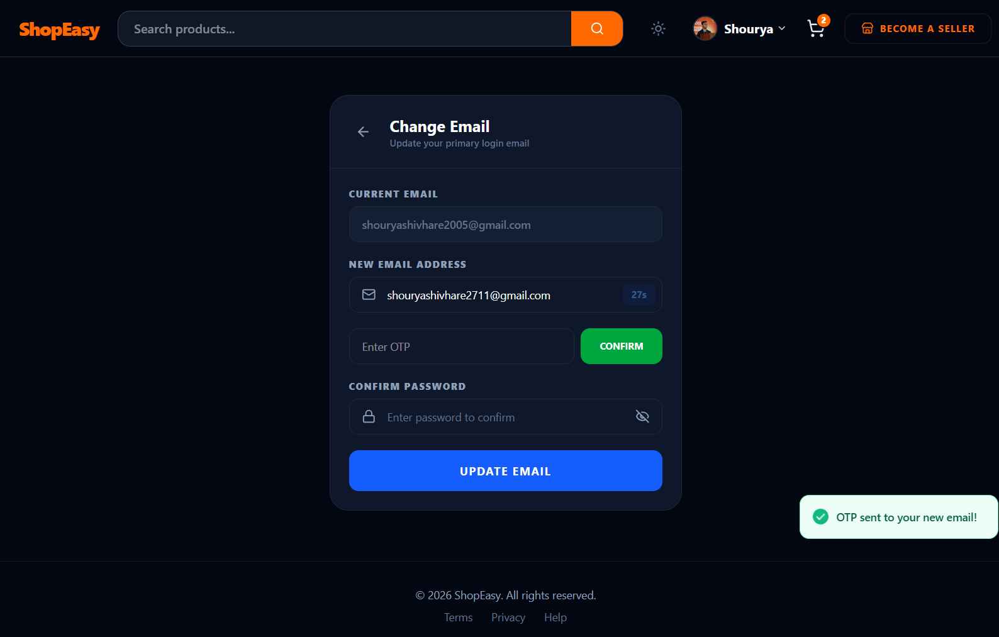</td>
  </tr>
</table>

**Features:**
* **Credential Management:** Secure workflows to update **Password** and **Email** with multi-step verification to prevent unauthorized changes.
* **Account Deactivation:** A "Delete Forever" option that allows users to exercise their right to be forgotten, ensuring full data privacy compliance.
* **Sensitive Action Protection:** Integrated "Forgot Password" and "Forgot Email" recovery pages to assist users in regaining account access.
* **Real-time Feedback:** Visual confirmation for successful security updates and clear error handling for invalid credentials.

#### 🔍 Product Intelligence & Details
A high-conversion product page designed with interactive elements and real-time data synchronization to enhance the shopping experience.

| Product Details | Product Reviews |
| :---: | :---: |
| 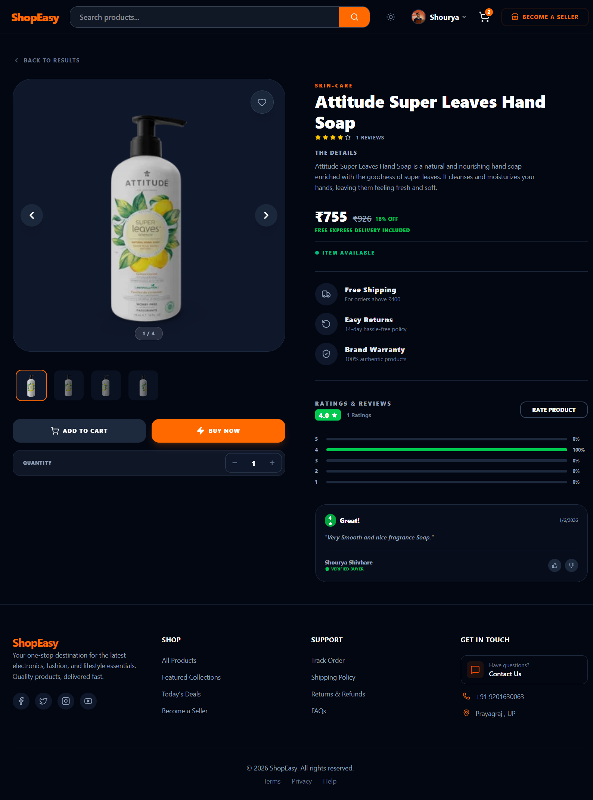 |  |

**Features:**
* **Dynamic Image Gallery:** Implements a multi-image carousel with thumbnail switching, full-screen previews, and smooth transition effects.
* **Intelligent Wishlist Sync:** Real-time "Heart" toggle that synchronizes with LocalStorage and the backend API, providing instant visual feedback via a custom `wishlistUpdated` event.
* **Smart Pricing & Delivery Logic:** * Automatically calculates **Discount Percentages** based on MRP vs. Price.
    * Dynamic **Shipping Calculator** that toggles "Free Delivery" badges based on a ₹400 price threshold.
* **Inventory Urgency System:** A sophisticated stock tracker that displays "Low Stock" pulses and progress bars when items are below 5 units, or a "Sold Out" state when empty.
* **Advanced Review Ecosystem:** * Visual **Rating Distribution Bar Chart** (5-star to 1-star breakdown).
    * **Verified Buyer** badges for authenticated reviewers.
    * Social interactivity with **Helpful/Not Helpful** (Thumbs Up/Down) feedback on comments.
* **Seamless Purchase Flow:** Direct **"Buy Now"** integration that bypasses the cart for faster checkout, maintaining state-aware navigation for non-logged-in users.

#### 🛒 Smart Cart & Order Orchestration
The Cart system acts as a high-performance bridge between product discovery and final payment, focusing on price transparency and psychological purchase triggers.

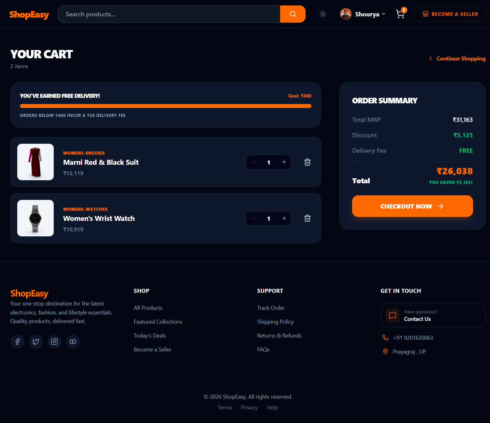

**Features:**

* **Gamified Free Shipping Tracker:**
    * Features a dynamic **Progress Bar** that visually calculates the distance to the ₹400 free delivery threshold.
    * Implements conditional UI messaging: *“Add ₹X more for FREE delivery”* vs. *“You've earned FREE delivery!”*
* **Precision Price Engine:**
    * **Savings Transparency:** Automatically calculates the delta between **Total MRP** and **Discounted Subtotal** to display a "You Saved" badge.
    * **Live Summary:** A sticky sidebar updates instantly as users modify quantities, handling subtotals, shipping fees, and final payable amounts.
* **State-Synchronized CRUD Operations:**
    * Uses **Optimistic UI patterns** for quantity updates (`+` / `-`), ensuring the interface feels snappy while the backend synchronizes.
    * Implements a **Global Event Dispatcher** (`cartUpdated`) to ensure the Navbar count reflects changes made within the Cart page immediately.
* **Checkout Readiness:**
    * The "Checkout Now" action performs a clean data mapping, packaging product IDs, seller info, and final price states into the `react-router` state for a secure handover to the payment gateway.
* **Empty State Management:**
    * Includes a dedicated "Empty Cart" UI with a clear Call-to-Action (CTA) to drive users back to the shopping loop when no items are present.

##### **Technical Workflow**

| Feature | Implementation Detail |
| :--- | :--- |
| **Quantity Guard** | Prevents values < 1 and checks against `product.stock` limits. |
| **Image Fail-safe** | Uses a `getImageUrl` utility with `ImageOff` fallback for broken links. |
| **Data Persistence** | Syncs with MongoDB via JWT-authorized API calls. |
| **Routing** | Uses `useLocation` to pass the "Checkout Manifest" to the Payment page. |


### 🛒 ShopEasy Seller

#### 🏪 Seller Access Point
Quick and secure entry for merchants to manage their digital storefront.

| Seller Login | Seller Signup |
| :---: | :---: |
| 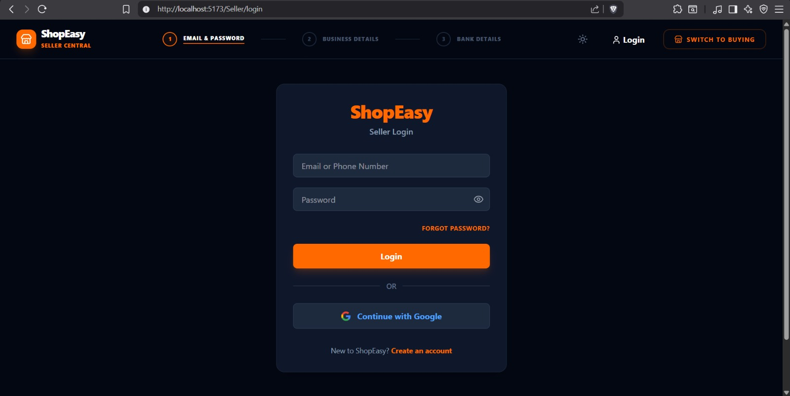 | 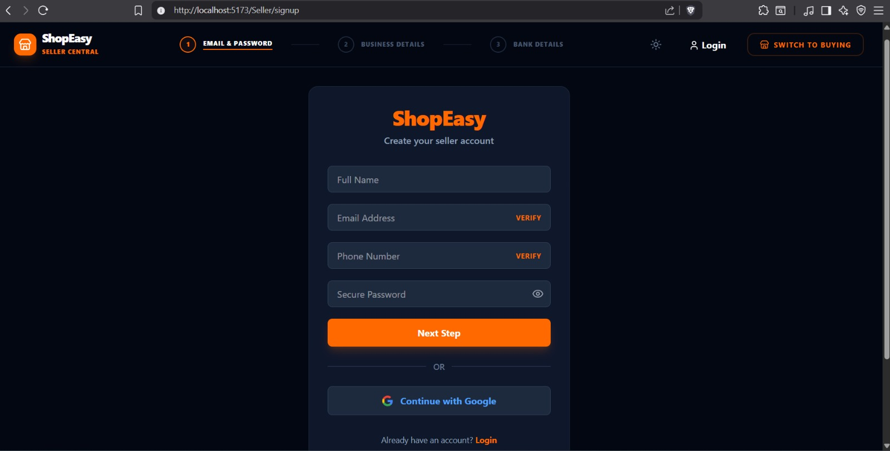 |
|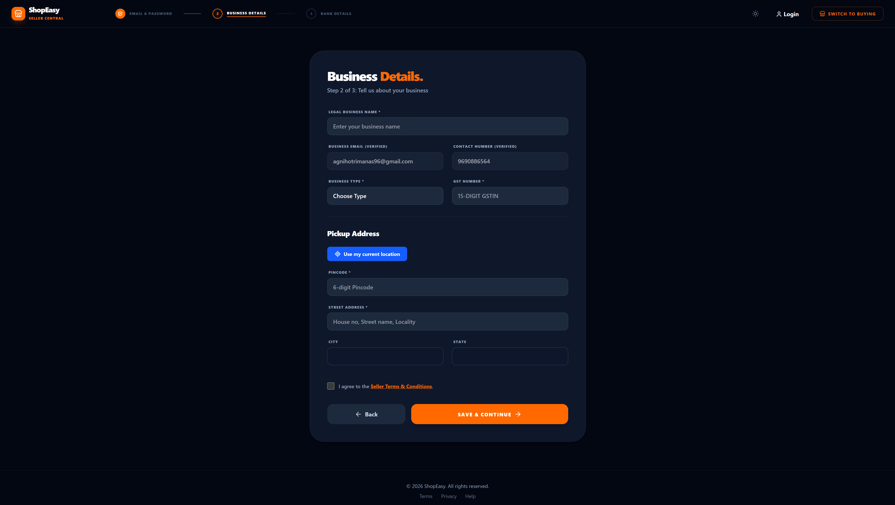 | 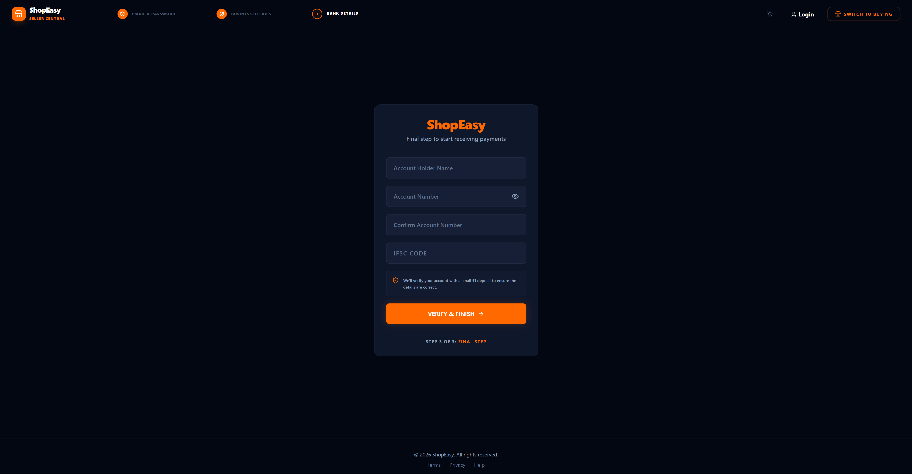 |


#### 🚀 Seller Home Interface
Once authenticated, sellers land on this intuitive entry point to manage their digital storefront.


---

#### 🔔 Real-time Notifications
The notification hub ensures sellers never miss a beat—tracking every order milestone from placement to cancellation.

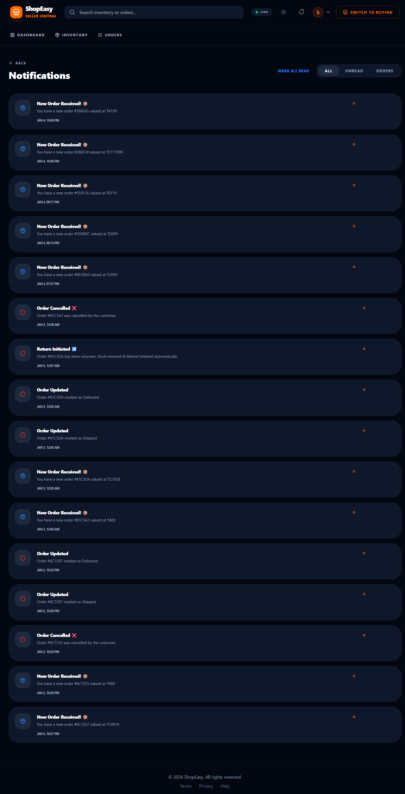

* **Order Alerts:** Instant updates when a customer places a new order.
* **Status Changes:** Real-time tracking for successful payments or order cancellations.
* **Action Oriented:** Designed for quick navigation to the specific order for immediate fulfillment.

---

#### 📊 Seller Dashboard
The dashboard provides a high-level overview of business health, combining real-time data with proactive inventory management.

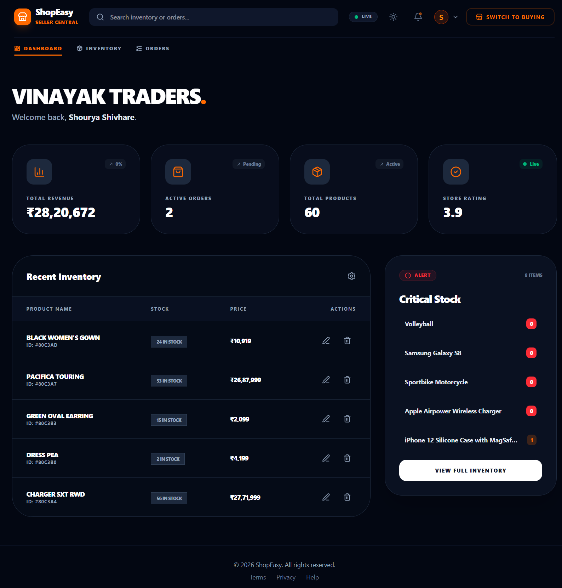

**Key Features Engineered:**
* **⚡ Real-Time Socket Connectivity:** Integrated `Socket.io` to listen for `order_alert` events, allowing the dashboard to refresh and notify sellers the instant a sale happens without a page reload.
* **📉 Smart Inventory Tracking:** A dedicated **Critical Stock** algorithm that auto-filters products with fewer than 5 units, helping merchants prevent "Out of Stock" scenarios.
* **💰 Financial Analytics:** Dynamic calculation of **Total Revenue**, **Active Orders**, and **Store Ratings** with visual trend indicators.
* **🛠️ Full CRUD Operations:** Streamlined product management (Create, Read, Update, Delete) directly from the "Recent Inventory" table with optimistic UI updates.
* **🔐 Session & Security:** Robust token-based authentication with automatic session expiration handling and secure API communication.

---

#### 📦 Dynamic Inventory Management
A high-performance interface for merchants to oversee their product catalog with real-time stock monitoring.


| Add New Product | Edit & Refine |
| :---: | :---: |
| 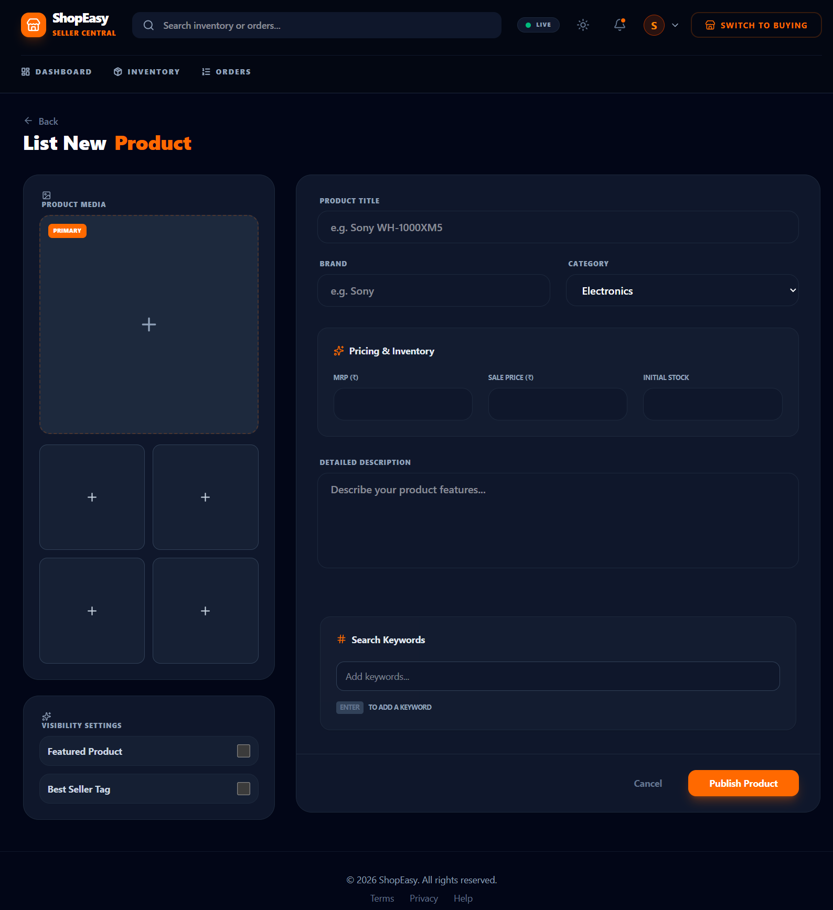 | 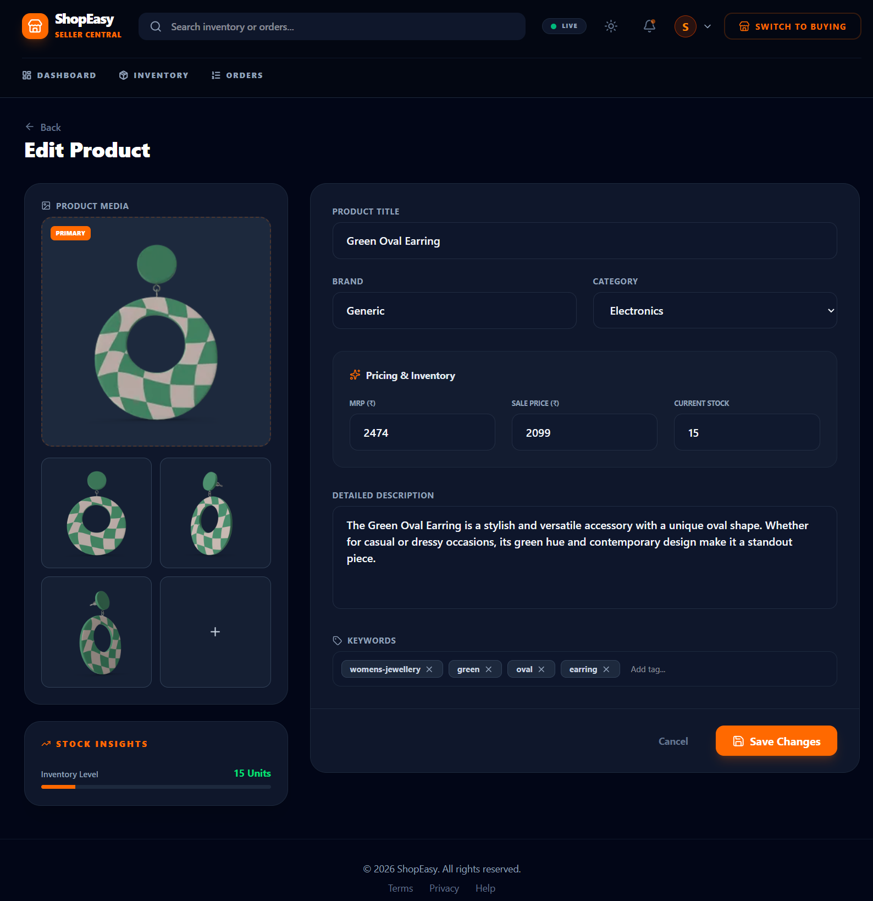 |

**Technical Implementation Details:**
* **Comprehensive CRUD operations allowing merchants to seamlessly onboard new items or adjust existing listings with real-time validation.
* **🔄 Socket-Driven Stock Sync:** The page utilizes `Socket.io` to listen for background inventory changes. If a customer purchases an item, the stock count updates **silently and automatically** without requiring a page refresh.
* **🔍 Optimized Local Filtering:** Implemented a high-speed search and filter mechanism that allows sellers to navigate large catalogs instantly by product name or category.
* **🛡️ Session Persistence:** Configured with `credentials: "include"` and robust 401 interceptors to ensure that merchant sessions remain secure and valid across all administrative actions.
* **⚠️ Visual Stock Alerts:** Integrated a color-coded status system:
    * **Red:** Out of Stock alert.
    * **Amber:** Low Stock warning (under 10 units).
    * **Slate:** Healthy inventory levels.
* **✨ Smooth UX Operations:** Features like "Silent Refresh," manual override sync, and optimistic UI deletions ensure a lag-free experience for the merchant.

---

#### 🚚 Advanced Order Fulfillment System
A high-performance dashboard designed for merchants to manage the end-to-end lifecycle of customer orders with real-time synchronization and professional reporting.

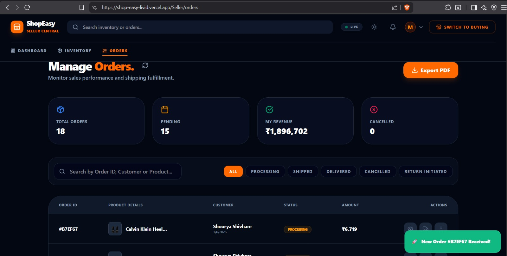

**Key Technical Implementations**

* **⚡ Real-Time Order Alerts (Socket.io):** Implemented a dedicated "Seller Room" using WebSockets. When a customer places an order, the merchant receives an instant background sync via the `order_alert` event. This ensures zero-latency fulfillment without manual page reloads.
    
* **📄 Enterprise-Grade PDF Reporting:** Integrated a custom export engine using `jsPDF` and `autoTable`. Merchants can generate timestamped, branded fulfillment reports that include:
    * Masked Order IDs & Customer Contact Details.
    * Formatted Shipping Manifests for logistics.
    * Revenue breakdowns for offline bookkeeping and accounting.

* **📊 Live Business Intelligence:** The dashboard features a real-time stats grid that dynamically calculates:
    * **Net Revenue:** Real-time calculation of seller earnings (`sellerTotal`).
    * **Fulfillment Ratio:** Instant visibility of Pending vs. Delivered vs. Cancelled orders.


* **🔄 Context-Aware State Management:** The UI utilizes intelligent conditional rendering to toggle action buttons based on the order's `status` (e.g., "Mark as Shipped" only appears for "Processing" orders). This prevents logical state errors and streamlines merchant operations.

* **🔍 Granular Order Inspection:** A deep-dive Modal interface provides complete transparency into:
    * **Payment Verification:** Real-time verification of `isPaid` (Paid vs. Pending).
    * **Product Manifests:** Multi-item support with individual quantity and unit-price tracking.
    * **Shipping Logs:** Direct access to customer coordinates and phone contact info.

---
#### ⚙️ Merchant Settings & Compliance
A comprehensive configuration suite allowing sellers to manage their identity, business legitimacy, and financial routing.

##### 🏢 Core Configuration Modules

| Module | Description | Technical Feature |
| :--- | :--- | :--- |
| **Account Info** | Personal merchant profile and secure credential management. | **Session-Linked updates** |
| **Business Details** | Legal entity registration, Tax/GST information, and business type. | **Data Validation Logic** |
| **Store Address** | Physical fulfillment location and logistics coordination. | **Geographic Mapping** |
| **Bank Details** | Secure payout routing for automated revenue settlement. | **Encrypted Field Handling** |

---

##### 👤 1. Account & Security
The gateway for personal profile management. This module ensures that merchant contact information is always synchronized with the communication engine.
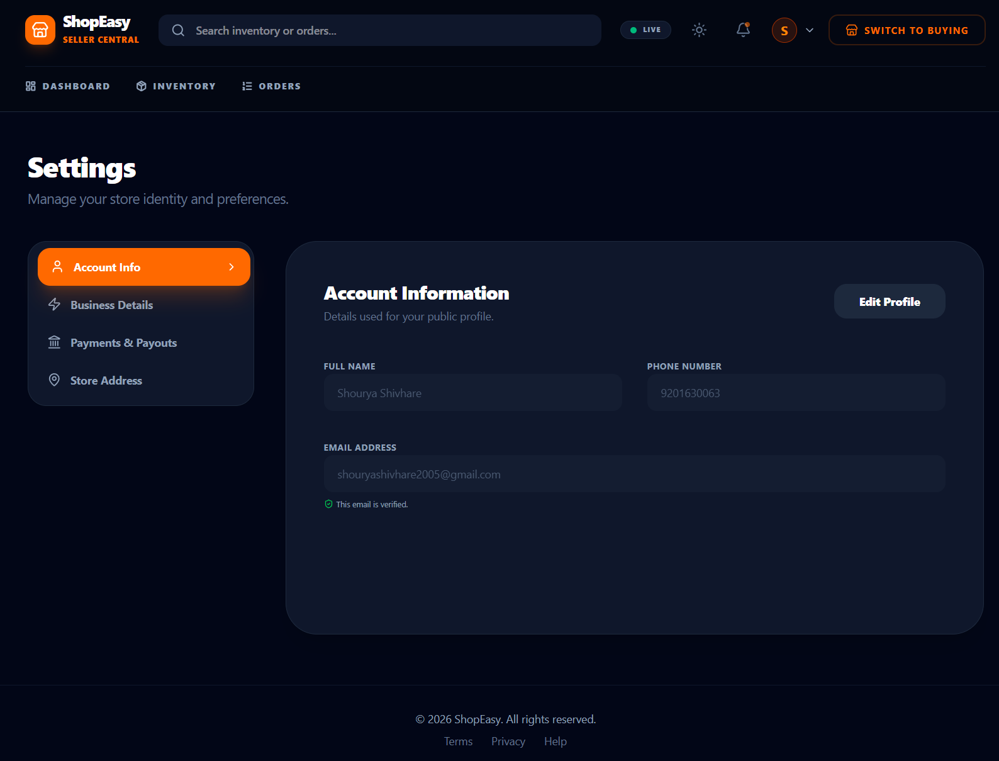

##### 📈 2. Business Legitimacy
A dedicated section for legal compliance. It handles the collection of business names, registration numbers, and tax identifiers required for legal e-commerce operations.
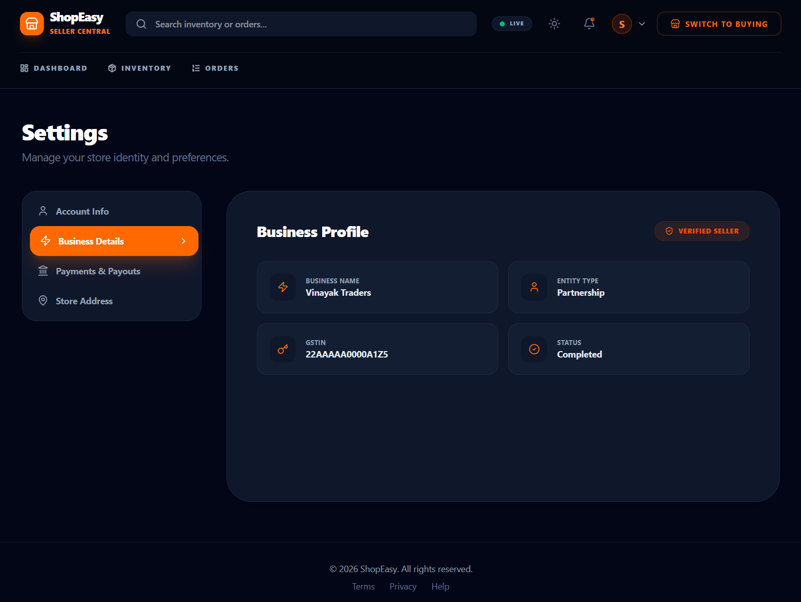


##### 🏦 3. Bank Details
A dedicated section for showing the bank details of the Seller.
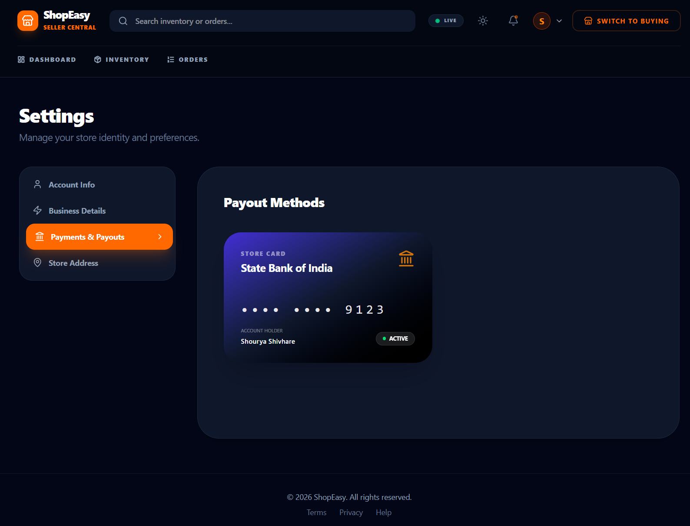

##### 📍 4. Fulfillment & Warehouse Logistics
Management of the primary shipping origin. This address is used by the logistics engine to calculate shipping rates and coordinate pick-ups for new orders.
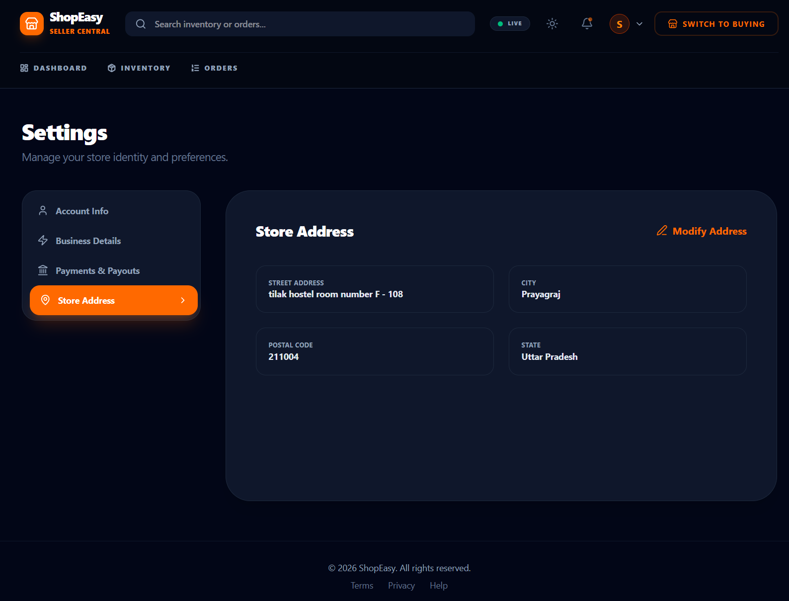


## 📞 Customer Communication & Support
A contact us page that shows the contact details and office address.

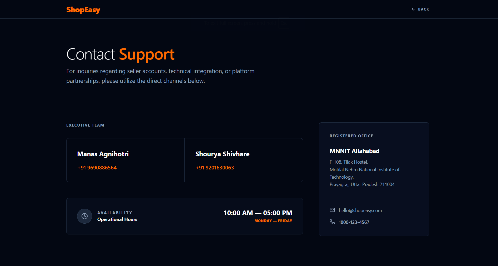


---

## 🚀 Conclusion & Future Roadmap

This project represents a comprehensive, full-stack implementation of a modern Multi-Vendor Marketplace. It bridges the gap between complex backend logic (Session management, MongoDB Aggregation, Socket.io) and a polished, responsive Frontend (React, Tailwind).

**The goal was simple:** To build a platform that is not just functional, but scalable, secure, and ready for real-world deployment.

### 🔮 Future Improvements
* [ ] AI-based Product Recommendations.

---

<div align="center">
  <h3>✨ Thank you for checking out this project! ✨</h3>
  <p>If you found this code helpful or interesting, please consider giving it a ⭐️.</p>

  <h3>🤝 Connect with the Team</h3>
  <table width="100%">
    <tr>
      <td align="center" width="50%" style="vertical-align: top;">
        <p><strong>Shourya</strong></p>
        <a href="https://github.com/shourya-shivhareE" target="_blank">
          
        </a>
        <br/>
        <a href="https://www.linkedin.com/in/shourya-shivhare-a9444130a/" target="_blank">
          
        </a>
        <br/>
        <a href="mailto:shouryashivhare2005@gmail.com">
          
        </a>
      </td>
      <td align="center" width="50%" style="vertical-align: top;">
        <p><strong>Manas</strong></p>
        <a href="https://github.com/manasdevX" target="_blank">
          
        </a>
        <br/>
        <a href="https://www.linkedin.com/in/manas-agnihotri-318117332/" target="_blank">
          
        </a>
        <br/>
        <a href="mailto:agnihotrimanas99@gmail.com">
          
        </a>
      </td>
    </tr>
  </table>

  <br />
  <p align="center"><i>Built with ❤️ using the MERN Stack</i></p>
</div>
