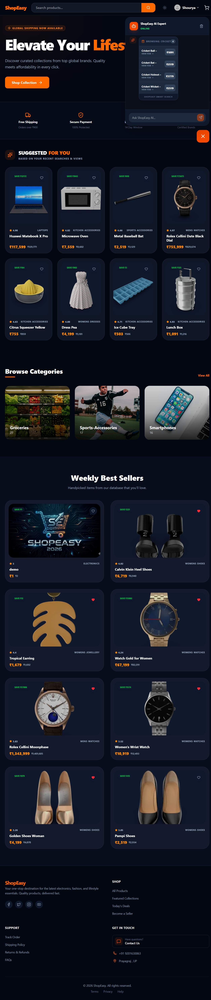

# 🛒 ShopEasy — Full-Stack E-Commerce Platform

ShopEasy is an enterprise-grade MERN-stack e-commerce ecosystem designed to bridge the gap between complex industrial marketplaces and small-scale independent merchants. The platform provides a dual-sided solution: a streamlined, high-conversion storefront for consumers and a robust, data-driven management suite for sellers.
## ✨ Features

### 👤 User Features

- Email & password authentication

- Google OAuth login

- Email OTP verification

- Cart management

- Account & profile management

- Dark / Light mode toggle


### 🏪 Seller Features

- Become a Seller flow

- Seller registration page

- Seller-specific navigation

- Product listing 

- Seller dashboard layout 
## 🔐 Authentication & Security

- JWT-based authentication

- Password hashing using bcrypt

- Protected routes (frontend & backend)

- Role-based access control

- Secure session handling
## 🛠️ Tech Stack

### Frontend

- React (Vite) — Fast single-page application

- Tailwind CSS — Utility-first styling with dark mode

- React Router DOM — Client-side routing

- Context API — Global state management

- Lucide React — Icon system

### Backend

- Node.js — JavaScript runtime

- Express.js — REST API framework

- MongoDB — NoSQL database

- Mongoose — ODM for schema modeling

- bcryptjs — Password encryption

- JWT — Secure authentication

- Nodemailer — Email & OTP delivery
## 🚀 Getting Started

### 1️⃣ Clone the Repository

```bash
git clone [https://github.com/manasdevX/ShopEasy.git](https://github.com/manasdevX/ShopEasy.git)
cd ShopEasy
```

### 2️⃣ Backend Setup (Terminal - 1)

```bash
cd backend
npm install
npm run start
```

### 3️⃣ Frontend Setup (Terminal- 2)

```bash
cd backend
npm install
npm run dev
```


## ⚙️ Environment Variables

```bash
# ========================
# SERVER CONFIG
# ========================
PORT=5000
FRONTEND_URL=http://localhost:5173

# ========================
# DATABASE
# ========================
MONGO_URI=mongodb+srv://<username>:<password>@cluster0.mongodb.net/<database_name>

# ========================
# AUTHENTICATION
# ========================
JWT_SECRET=your_jwt_secret_key_here
GOOGLE_CLIENT_ID=your_google_oauth_client_id_here

# ========================
# EMAIL (SMTP / BREVO)
# ========================
BREVO_API_KEY=your_brevo_api_key_here
EMAIL_USER=your_email@example.com
EMAIL_PASS=your_email_app_password_here
FROM_EMAIL=no-reply@shopeasy.com
FROM_NAME=ShopEasy

# ========================
# OTP / SMS (TWILIO)
# ========================
TWILIO_SID=your_twilio_sid_here
TWILIO_AUTH_TOKEN=your_twilio_auth_token_here
TWILIO_PHONE_NUMBER=+1234567890

# ========================
# CLOUDINARY (IMAGES)
# ========================
CLOUDINARY_CLOUD_NAME=your_cloudinary_cloud_name
CLOUDINARY_API_KEY=your_cloudinary_api_key
CLOUDINARY_API_SECRET=your_cloudinary_api_secret

# ========================
# PAYMENTS (RAZORPAY)
# ========================
RAZORPAY_KEY_ID=your_razorpay_key_id
RAZORPAY_KEY_SECRET=your_razorpay_key_secret

# ========================
# CACHE (REDIS)
# ========================
REDIS_HOST=your_redis_host
REDIS_PORT=your_redis_port
REDIS_PASSWORD=your_redis_password
```


## ⚙️ Usage

Once the application is set up and running, ShopEasy provides a complete e-commerce workflow for customers, sellers, and administrators.

### 👤 Customer Flow

#### 1. Account Access

- Users can sign up or log in using:

  - Email & password

  - Phone number with OTP

  - Google OAuth

- Authentication is secured via JWT tokens.

#### 2. Browsing & Shopping

- Browse products by categories from the navigation bar.

- View detailed product pages with pricing, ratings, availability, and images.

- Add products to the cart with quantity control.

#### 3. Cart & Checkout

- Review cart items and pricing in real time.

- Proceed to secure checkout.

- Complete payments using Razorpay with server-side verification.

#### 4. Profile Management

- Update personal details from the Account page.

- View saved addresses and manage profile preferences.

### 🛍️ Seller Flow

#### 1. Seller Registration

- Navigate to Become a Seller from the navigation bar.

- Complete seller registration with:

  - Business details

  - Contact information

  - Bank account details

#### 2. Seller Dashboard

- Access a dedicated seller panel after approval.

- Add, edit, and manage product listings.

- Upload product images via Cloudinary.

#### 3. Product & Inventory Control

- Update stock levels and pricing.

- Monitor product availability and performance.

- Manage listed products in real time.


## 📸 Screenshots

### 🛒 ShopEasy User

#### 🔐 Authentication & Onboarding
We’ve designed a secure and intuitive entry point for our merchants, featuring a multi-step registration process to ensure data integrity.

| Existing User Login | New User Signup |
| :---: | :---: |
|  |  |

**Features:**
* **Instant Validation:** Real-time feedback on email formats and password strength to reduce user errors.
* **Seamless Switching:** Easy toggle between login and signup modes to minimize friction.
* **Secure Sessions:** Implementation of JWT-based authentication to keep user sessions safe across page reloads.
* **Verification:** Real time Otp based verification system for email and phone number.

### 🛍️ Customer Experience
A seamless shopping interface designed for high performance and easy product discovery.

| Home Page | Product Search |
| :---: | :---: |
|  |  |

**Features:**
* **Responsive Layout:** Clean, modern interface optimized for desktop browsing.
* **Intuitive Search:** Fast, reliable search functionality to find products across all categories.


